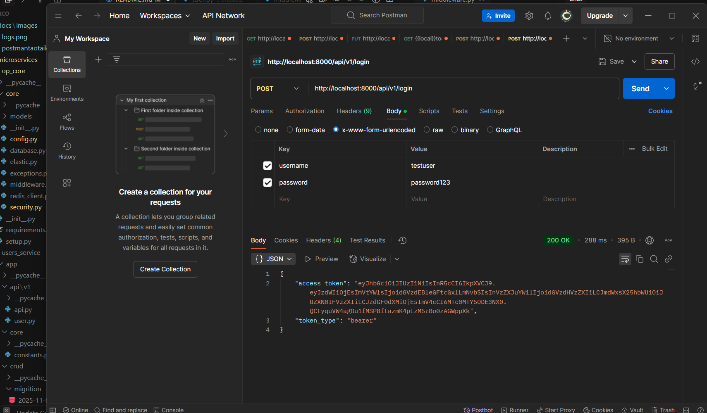
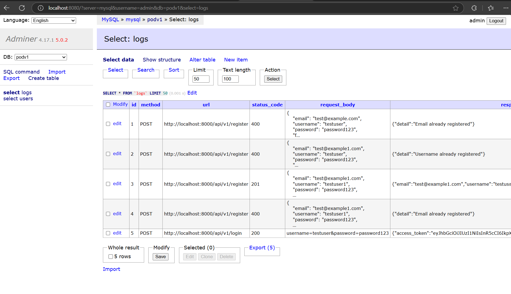

# Microservices Project

Dự án microservices sử dụng FastAPI, MySQL, Redis và Docker với các tính năng bảo mật nâng cao.

## Yêu cầu hệ thống

- Docker và Docker Compose
- Python 3.9 hoặc cao hơn (nếu chạy không dùng Docker)
- MySQL 8.0 hoặc cao hơn (nếu chạy không dùng Docker)
- Redis 6.0 hoặc cao hơn (nếu chạy không dùng Docker)

## Cài đặt và Chạy

### 1. Khởi động các services bằng Docker

```bash
# Clone repository (nếu chưa có)
git clone https://github.com/giabaohb99/mirco.git
cd mirco

# Build và chạy các services
docker-compose up --build
```

Các services sẽ chạy ở các cổng sau:
- Users Service API: http://localhost:8000
- MySQL: localhost:3399
- Redis: localhost:6379
- Adminer (MySQL Management): http://localhost:8080

### 2. Khởi tạo Database

#### Sử dụng Adminer:
1. Truy cập http://localhost:8080
2. Đăng nhập với thông tin:
   - System: MySQL
   - Server: mysql
   - Username: admin
   - Password: 123456
   - Database: podv1

#### Chạy migration SQL:
1. Mở Adminer và đăng nhập như trên
2. Chọn database "podv1"
3. Vào tab "SQL command"
4. Copy và thực thi các câu lệnh SQL sau:

```sql
-- Tạo bảng users
CREATE TABLE `users` (
  `id` int NOT NULL AUTO_INCREMENT PRIMARY KEY,
  `email` varchar(255) NOT NULL,
  `username` varchar(255) NOT NULL,
  `hashed_password` varchar(255) NOT NULL,
  `full_name` varchar(255) NOT NULL DEFAULT '',
  `status` int NOT NULL DEFAULT '0',
  `created_at` int NOT NULL DEFAULT '0',
  `updated_at` int NOT NULL DEFAULT '0'
) COLLATE 'utf8mb4_0900_ai_ci';

-- Tạo bảng logs để theo dõi API calls
CREATE TABLE logs (
    id INT AUTO_INCREMENT PRIMARY KEY,
    method VARCHAR(10) NOT NULL,
    url VARCHAR(255) NOT NULL,
    status_code INT,
    request_body TEXT,
    response_body TEXT,
    ip_address VARCHAR(50),
    user_agent VARCHAR(255),
    process_time FLOAT,
    created_at DATETIME DEFAULT CURRENT_TIMESTAMP,
    sql_queries text NULL,
    INDEX idx_created_at (created_at),
    INDEX idx_method (method),
    INDEX idx_status_code (status_code)
);
```

Hoặc sử dụng command line:
```bash
# Chạy file migration
docker-compose exec mysql mysql -u admin -p123456 podv1 < microservices/users_service/app/crud/migrition/2025-11-03-192100.sql
```

## Tính năng Bảo mật

### 1. Rate Limiting
- Giới hạn số lượng request từ mỗi IP
- Cooldown period giữa các request
- Theo dõi request theo path và body hash
- Trả về thông tin chi tiết khi vượt quá giới hạn

### 2. Logging và Monitoring
- Log tất cả các request/response
- Theo dõi SQL queries và thời gian thực thi
- Tự động xóa logs cũ (mặc định 30 phút)
- Log chi tiết các lỗi và stack traces

### 3. Error Handling
- Xử lý lỗi chi tiết cho SQL queries
- Trả về JSON responses với thông tin lỗi
- Log các lỗi với timestamp
- Bảo vệ thông tin nhạy cảm trong logs

### 4. Redis Security
- Yêu cầu mật khẩu cho Redis
- Phân tách databases cho các mục đích khác nhau
- Rate limiting sử dụng Redis
- Persistent storage cho Redis data

## API Endpoints

### 1. Đăng ký người dùng

```bash
curl -X POST http://localhost:8000/api/v1/register \
  -H "Content-Type: application/json" \
  -d '{
    "email": "test@example.com",
    "username": "testuser",
    "password": "password123",
    "full_name": "Test User"
  }'
```

Hoặc sử dụng Postman:
- Method: POST
- URL: http://localhost:8000/api/v1/register
- Headers: Content-Type: application/json
- Body (raw JSON):
```json
{
    "email": "test@example.com",
    "username": "testuser",
    "password": "password123",
    "full_name": "Test User"
}
```

### 2. Đăng nhập

```bash
curl -X POST http://localhost:8000/api/v1/login \
  -H "Content-Type: application/x-www-form-urlencoded" \
  -d "username=testuser&password=password123"
```

Response sẽ trả về access token để sử dụng cho các API khác.

## Kiểm tra Logs

### 1. Truy cập Logs qua Adminer
1. Truy cập Adminer: http://localhost:8080
2. Đăng nhập như hướng dẫn ở trên
3. Chọn database "podv1"
4. Chọn bảng "logs"
5. Xem các request logs với câu lệnh:
```sql
SELECT * FROM logs ORDER BY created_at DESC;
```

### 2. Redis Monitoring
1. Truy cập Redis CLI:
```bash
docker exec -it mirco_redis_1 redis-cli
AUTH 123456789
```

2. Các lệnh Redis hữu ích:
```bash
# Xem tất cả keys
KEYS *

# Xem thông tin server
INFO

# Xóa tất cả keys trong database hiện tại
FLUSHDB

# Xóa tất cả keys trong tất cả databases
FLUSHALL
```

## Cấu trúc Project

```
mirco/
├── docker-compose.yml
├── microservices/
│   ├── op_core/                 # Core package
│   │   ├── core/
│   │   │   ├── models/
│   │   │   ├── config.py
│   │   │   ├── database.py
│   │   │   └── middleware.py
│   │   └── requirements.txt
│   └── users_service/           # Users microservice
│       ├── app/
│       │   ├── api/
│       │   ├── crud/
│       │   ├── models/
│       │   └── schemas/
│       ├── Dockerfile
│       └── requirements.txt
└── README.md
```

## Troubleshooting

### 1. Lỗi Kết nối MySQL
- Kiểm tra logs: `docker-compose logs mysql`
- Đảm bảo port 3399 không bị sử dụng
- Kiểm tra thông tin đăng nhập trong docker-compose.yml

### 2. Lỗi API không phản hồi
- Kiểm tra logs: `docker-compose logs users_service`
- Đảm bảo port 8000 không bị sử dụng
- Kiểm tra kết nối Redis và MySQL

### 3. Lỗi Rate Limiting
- Kiểm tra Redis logs: `docker-compose logs redis`
- Kiểm tra cấu hình rate limit trong config.py
- Xóa Redis cache nếu cần: `FLUSHALL` trong Redis CLI

### 4. Lỗi Logging
- Kiểm tra quyền truy cập database
- Kiểm tra cấu hình logging trong middleware.py
- Xem logs của service: `docker-compose logs users_service`

## Bảo mật và Best Practices

1. **Môi trường Production**
   - Thay đổi tất cả mật khẩu mặc định
   - Sử dụng HTTPS
   - Cấu hình firewall
   - Backup dữ liệu thường xuyên

2. **Rate Limiting**
   - Điều chỉnh giới hạn theo nhu cầu
   - Monitor số lượng request
   - Cấu hình cooldown period phù hợp

3. **Logging**
   - Điều chỉnh thời gian lưu logs
   - Monitor dung lượng logs
   - Backup logs quan trọng

4. **Database**
   - Backup thường xuyên
   - Monitor performance
   - Cleanup dữ liệu cũ

## Ví dụ Postman

1. Đăng ký tài khoản:


2. Đăng nhập:


3. Xem logs:


